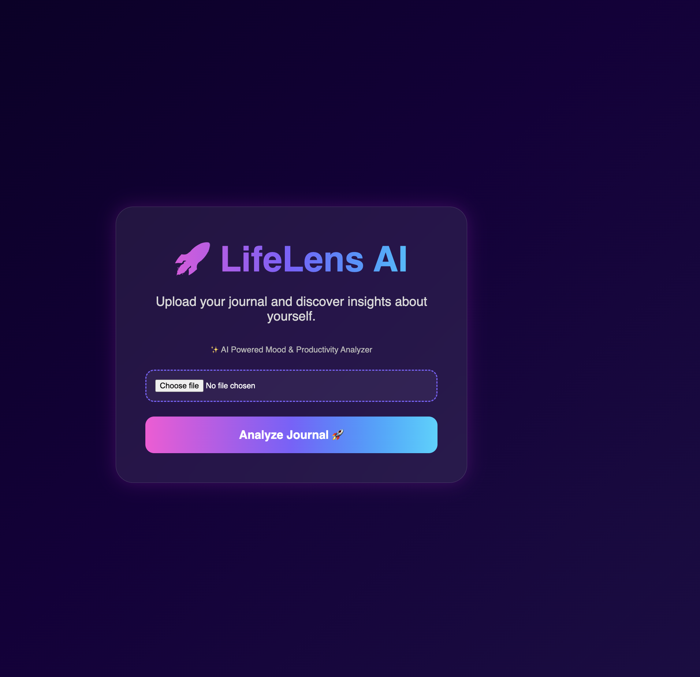
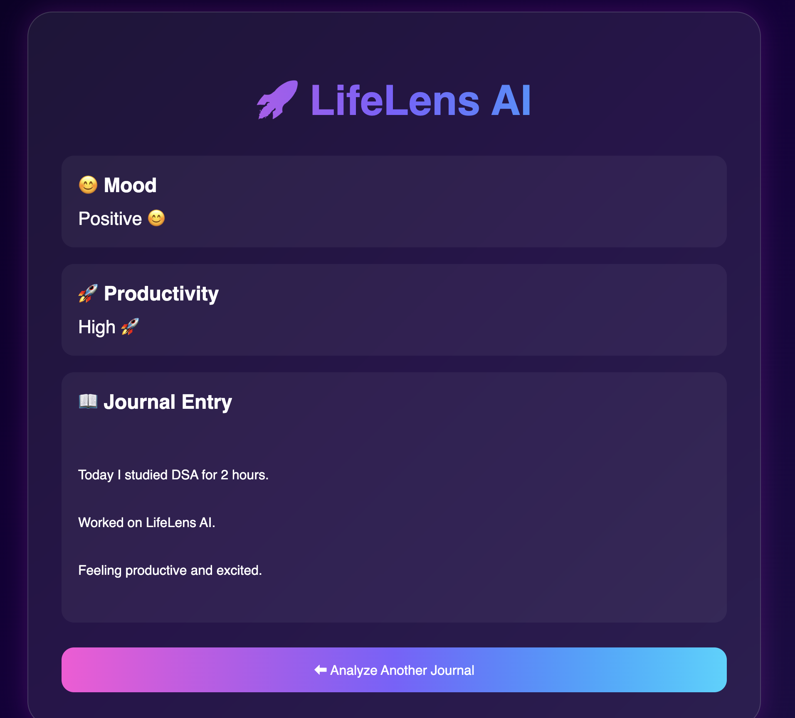
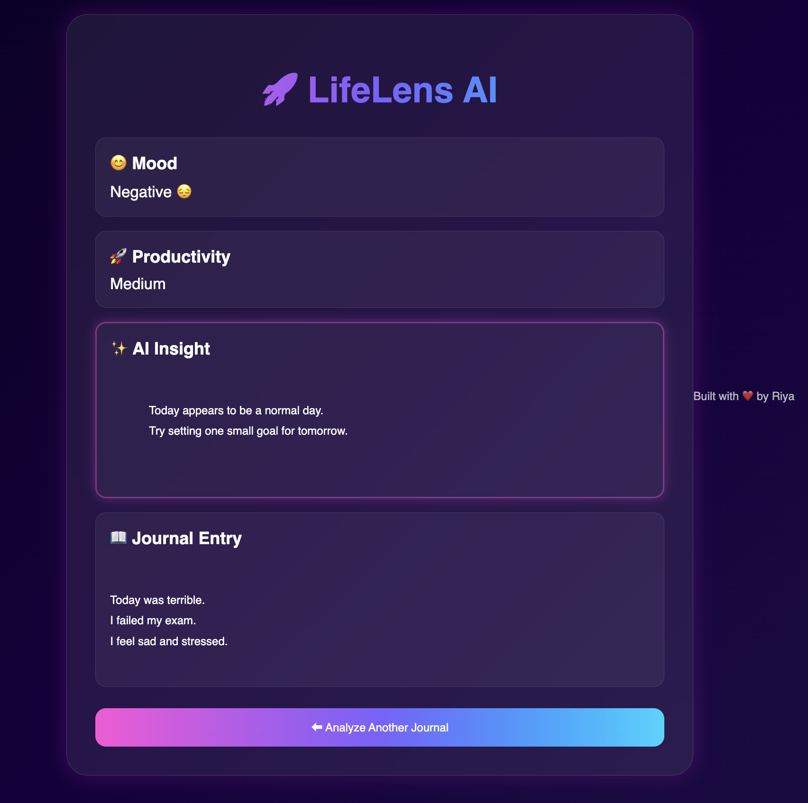

# 🧠 LifeLens AI – AI Powered Journal Sentiment & Productivity Analyzer

LifeLens AI is a Flask-based web application that analyzes journal entries using Natural Language Processing (NLP). Users can upload a journal file and receive AI-powered insights including mood detection, productivity analysis, sentiment score, reading time, word count, and a downloadable PDF report.

---

## ✨ Features

- 📄 Upload journal text files
- 😊 Mood Detection (Positive / Neutral / Negative)
- 🧠 Sentiment Analysis using TextBlob
- 🚀 Productivity Score Calculation
- 📊 Mood Score
- 📈 Word Count
- ⏱️ Reading Time Estimation
- 💡 AI Generated Insights
- 🌟 Daily Motivation
- 📥 Download Professional PDF Report

---

## 🛠️ Tech Stack

- Python
- Flask
- HTML
- CSS
- TextBlob (NLP)
- ReportLab (PDF Generation)

---

## 📂 Project Structure

```
LifeLensAI/
│
├── backend/
│   ├── app.py
│   └── test_app.py
│
├── frontend/
│
├── data/
│   ├── journal.txt
│   └── sad.txt
│
├── screenshots/
│   ├── home.png
│   ├── positive.png
│   └── negative.png
│
├── docs/
│
├── requirements.txt
├── README.md
└── .gitignore
```

---

## 📸 Screenshots

### 🏠 Home Page



---

### 😊 Positive Analysis



---

### 😔 Negative Analysis



---

## 🚀 Installation

### Clone the repository

```bash
git clone https://github.com/riya715/LifeLens-AI.git
```

### Move into the project

```bash
cd LifeLens-AI
```

### Create a virtual environment

```bash
python -m venv venv
```

### Activate it

**Windows**

```bash
venv\Scripts\activate
```

**macOS / Linux**

```bash
source venv/bin/activate
```

### Install dependencies

```bash
pip install -r requirements.txt
```

### Run the application

```bash
python backend/app.py
```

Open your browser:

```
http://127.0.0.1:5001
```

---

## 🎯 Future Improvements

- User Login & Authentication
- Journal History
- Mood Trends Dashboard
- AI Chat Assistant
- Cloud Deployment
- Database Integration
- Advanced NLP Models

---

## 👩‍💻 Author

**Riya Kumari**

Computer Science (AI & ML) Student

Built with ❤️ using Flask, NLP, and Python.

---

## ⭐ If you like this project

Please consider giving it a ⭐ on GitHub.
